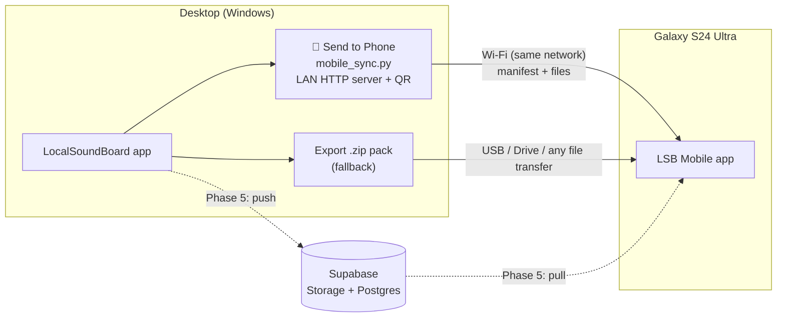
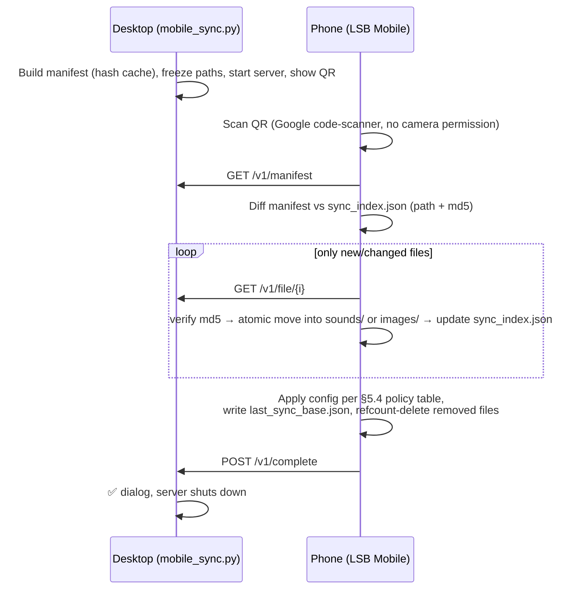
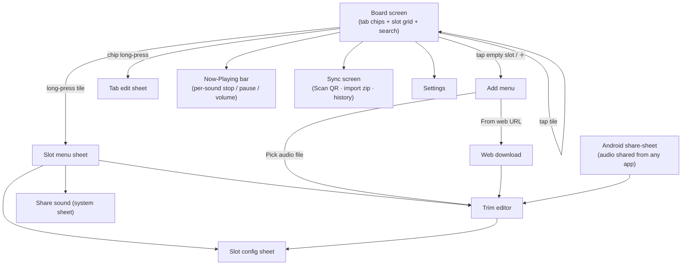

# LSB Mobile — Android Companion App (Project Plan)

> **Status:** Phases 0–2 SHIPPED (desktop exporter · Android app verified on-device · Wi-Fi QR delta sync + in-app APK updater) · 💻/📱 master sections on both apps · Phase 3 BUILT (phone tabs, SAF/share-sheet import, trim editor, web download — APK v3). This document is the source of truth for the mobile project.
> **Created:** 2026-08-07 · **Verified:** claims fact-checked against the repo + Android platform docs on 2026-08-07
> **Target device:** Samsung Galaxy S24 Ultra (Android 14/15, One UI, 6.8" 120 Hz, 12 GB RAM)
> **Stack:** Kotlin + Jetpack Compose (native Android, sideloaded APK — no Play Store)
> **Parent project:** the desktop LocalSoundBoard app in the repo root (`../`)
> **Desktop-side counterpart doc:** `../copilot-instructions.instructions.md` § "Mobile Companion App"

---

## 1. What this is

A **playback-only soundboard for the phone**: the same tabs, sound tiles, colors, emojis and
per-sound settings as the desktop app — but the sound just plays out of the phone speaker
(or whatever the phone is outputting to). The desktop library moves to the phone over Wi-Fi
with a QR-code pairing flow (and later through Supabase cloud sync).

### Goals

1. Play sounds on the phone: tap a tile → sound plays, overlapping playback, stop-all.
2. Same organization as desktop: tabs (name/emoji/color), slot grid, search, group tags.
3. Same per-sound settings: volume, speed with pitch-preserve, loop (count + delay).
4. **Move sounds desktop → phone** with one button + one QR scan; later syncs transfer only what changed.
5. Build the library on the phone too: add local audio files, share-sheet import, trim editor, web/YouTube download.
6. Hebrew/RTL must be first-class — 301 of 611 library files have Hebrew names.

### Non-goals (explicitly out of scope)

- ❌ No mic passthrough, no virtual-mic, no PTT, no voice changer, no noise suppression, no call recording.
- ❌ The phone app is **not** an audio source for Discord/WhatsApp/other apps. Not now, maybe never.
- ❌ No Play Store release. Personal sideloaded APK for one device.
- ❌ No accounts/paywalls in v1 (Supabase auth only arrives with cloud sync in Phase 5, reusing the
  desktop's planned Supabase design — see `../docs/AUTH_AND_SUBSCRIPTION.md`).
- ⏸ "Send sounds into WhatsApp chats" — parked in §12 Later Ideas (share-sheet **out** is easy; true
  voice-note injection is not possible with WhatsApp's public surface).
W
---

## 2. The two projects and how they connect

```
e:\CursorRepos\LocalSoundBoard\          ← desktop app (Python / CustomTkinter), repo root
├── soundboard/                          ← desktop source
│   └── mobile_sync.py                   ← NEW (Phase 0): pack builder + LAN server + QR dialog
├── soundboard_config.json               ← the whole desktop library state
├── sounds/  images/                     ← the actual media files
├── docs/
└── mobile/                              ← THIS project (the Android companion)
    ├── README.md                        ← this plan
    └── android/                         ← Android Studio project (created in Phase 1)
```

Both live in one git repo because they share one contract: the **SoundPack format** (§6).
The desktop exports packs; the phone imports them. Rule recorded on the desktop side:
**any change to the desktop config schema (`soundboard/models.py`), `sounds/` naming, or
`images/` naming must update §6 of this file and bump `format_version`.**



**Sync direction:** one-way desktop → phone in v1. The pack format and the phone's data model
are designed so two-way ("send phone-added sounds back to desktop") can be added later without
rework (§5.4, §6.5).

---

## 3. What the desktop app is (context) and real library numbers

The desktop app replaces Discord's soundboard: it mixes mic + sound files into a VB-Audio
virtual cable that Discord reads as a microphone. The phone app takes **only the library and
playback half** of that. Everything mic/cable-related stays on the desktop.

Verified numbers from the live library (2026-08-07) — these size every design decision below:

| Fact | Value |
|---|---|
| Sound files | 611 files, 773 MB total; **~583 referenced ≈ 630 MB** (28 orphans never transfer) |
| Formats in practice | 476 `.wav` (all PCM16 48 kHz — 381 stereo + **95 mono**), 128 `.mp3`, 7 `.ogg` — all Android-native codecs; player + trim editor must handle mono |
| Largest file | 77.8 MB (2 h 50 m MP3); several 19–40 MB files |
| Tabs / slots | 19 tabs, **485 tab slots** (largest tab 104); 650 SoundSlot records total incl. the 165 person-group copies |
| People / groups | 10 persons sharing 22 groups (165 person-slot copies), 14 custom group tags |
| Images | 145 files, 28 MB; 220 slots have thumbnails; multiple slots can share one image |
| Hebrew filenames | 301 of 611 — all NFC-normalized, ≤163 UTF-8 bytes, byte-exact config↔disk match |
| Config | `soundboard_config.json`, ~390 KB, UTF-8 no BOM, `ensure_ascii=False` (raw Hebrew/emoji) |
| `audio_cache/` | ~2.7 GB of decoded PCM `.npy` — **rebuildable, never transferred** |

---

## 4. Feature scope

### 4.1 Version 1 (decided 2026-08-07)

| Feature | Notes |
|---|---|
| Tabs | Horizontal chip row (emoji + accent color), create/rename/re-color/re-emoji/delete/reorder |
| Slot grid | Per-tab grid, adjustable columns (default 3 portrait / 5 landscape), smooth with 100+ slots (LazyVerticalGrid) |
| Slot tiles | Color, emoji badge, image thumbnail, 2-line RTL-correct name, playback progress bar, tap = play, long-press = menu |
| Playback | Overlapping sounds, per-slot stop, global stop-all, master volume, pause/resume via Now-Playing mini-bar |
| Per-sound settings | Volume 0–200 %, speed 0.5–2.0× with preserve-pitch toggle, loop + count (0 = ∞) + delay 0–10 s |
| Search + filters | Debounced cross-tab search over name/emoji/groups, group-tag filter chips |
| Group tags | Slot tags + manage tags (mirrors desktop `custom_groups`; union-merged on sync, §5.4) |
| Add sounds | SAF file picker, Android share-sheet ("Share to LSB Mobile"), both copy into app storage with the desktop naming convention. New content lands in **phone-origin tabs only** (§5.4) |
| **Trim editor** | Waveform, touch-drag start/end handles, pinch zoom, play selection, **multi-cut**, save-as-new (never destructive), Clone/re-trim via `source_file_path` |
| **Web / YouTube download** | Paste URL → downloads audio → trim → slot. Sideloaded app, so no store-policy issues (§7.7) |
| Slot config | Name (RTL entry), emoji picker, color palette (ported 7-family palette from desktop `constants.py`), image via photo picker, volume/speed/loop, tags |
| **Wi-Fi sync (pull)** | Scan QR shown by desktop → incremental pull (§6); dedicated 📷 button on the board opens the scanner directly; in-app APK self-update when the PC has a newer build (§6.3 `app` block) |
| Basic slot edit | Long-press a tile → name / volume / speed / pitch-preserve / loop (count + gap); §5.4 warning shown on desktop-owned tabs (next sync overwrites) |
| Zip import | Import a full SoundPack `.zip` via file picker (fallback transport + how Phase 1 is tested before the server exists) |
| Data safety | Desktop's layered-backup pattern ported: atomic writes, `.bak`, rotating backups, never-overwrite-with-empty guards (§7.5) |

### 4.2 Later phases (explicitly deferred, data still transfers now)

- **People boards + Favorites** (Phase 4): the pack already carries `persons` and `favorites_board`;
  the phone stores them untouched from day one — Phase 4 only adds screens.
- **Queue + DJ/Now-Playing panel** (Phase 4): desktop's queue-with-gap-delay and live tweak panel.
- **Supabase cloud sync** (Phase 5) and **two-way sync** (Phase 5).
- Home-screen widgets / app shortcuts for favorite sounds.

### 4.3 Desktop features that intentionally do not exist on the phone

Mic passthrough, device pickers, stream start/stop, PTT (both kinds), voice changer,
noise suppression, call recording, global hotkeys (field carried opaquely for round-trip;
zero slots use it in real data anyway), hover-preview key, AFK auto-play (desktop-call-keepalive
purpose; can be revisited), tray/DPI/multi-window machinery.

---

## 5. Data model and the compatibility contract

### 5.1 Source of truth: the desktop schema, verbatim

The phone keeps the library in **one JSON file using the exact desktop schema**
(`filesDir/soundboard_config.json`), parsed into typed Kotlin models with
`kotlinx.serialization`. This buys:

- lossless round-trip (future two-way sync can emit a file the desktop reads),
- a trivially testable importer (feed it the real 390 KB config),
- no schema-migration project on either side.

**Unknown-field rule:** every object is also retained as its raw `JsonObject`; known fields are
projected out for the UI, and on save the raw object is re-emitted with only the known fields
updated. Desktop-only keys (`ptt_key`, `voice_changer`, `noise_suppression*`, `hotkey`, …)
survive untouched.

**Full shape of the container types** (defined in `../soundboard/models.py` — that file is
normative if this table ever drifts):

```
config.tabs: [ SoundTab { name, emoji, color, section, slots: {"<str grid index>": SoundSlot} } ]   ← sparse keys!
             section: "pc" (default) | "phone" — master section, ASSIGNED ON THE PC
             (tab edit dialog → "📱 Phone section"); the phone app defaults to
             showing the "phone" section with a switcher to view "pc".
             Orthogonal to the phone-side `origin` sync-ownership key.
config.persons: [ Person { name, color, emoji, image_path, groups: [PersonGroup] } ]
PersonGroup { id (stable, shared across ALL persons), name, color, emoji,
              collapsed (per-person view state), sounds: [SoundSlot] }
config.favorites_board: Person-shaped record or null/absent (groups act as folders)
config.custom_groups: [str]        ← the main-board tag registry
```

`SoundSlot` fields the phone actively uses:

| Field | Type / range | Phone v1 use |
|---|---|---|
| `name` | str (often Hebrew) | Tile label, search |
| `file_path` | str, relative `sounds\…` (backslash!) | Normalized to `sounds/…` under `filesDir` |
| `volume` | float **0–2.0** (desktop UI caps 1.5, person dialog writes up to 2.0) | Playback gain (§7.3) |
| `speed` | float 0.5–2.0 | Playback rate |
| `preserve_pitch` | bool | pitch=1.0 vs chipmunk (§7.3) |
| `loop`, `loop_count`, `loop_delay` | bool, int (0 = ∞), float 0–10 s | Loop controller (§7.3 sentinel mapping) |
| `emoji`, `color`, `image_path` | str/null | Tile visuals |
| `groups` | list[str] | Tag filter |
| `source_file_path` | str/null | Clone/re-trim provenance (§7.6); **counts as a file reference** (§5.4) |
| `hotkey` | str/null | **Carried opaquely, no UI** |

**Reference-set definition** (used by the exporter's "referenced files", the importer, and the
delete refcounter — the single authoritative list of path-bearing fields):

```
referenced = union over:
  tabs[*].slots[*].file_path            tabs[*].slots[*].source_file_path
  tabs[*].slots[*].image_path
  persons[*].image_path (avatar)        persons[*].groups[*].sounds[*].{file_path, source_file_path, image_path}
  favorites_board.groups[*].sounds[*].{file_path, source_file_path, image_path}
```

### 5.2 Importer tolerance rules (all verified against the real config)

The importer MUST:

1. Normalize `\` → `/` in `file_path`, `source_file_path`, `image_path`; treat all as relative
   to app storage. Guard for absolute paths anyway (the code allows them even though slot data
   has none — see rule 6 for the one real case).
2. Preserve **sparse, string-keyed slot dicts** (`"slots": {"1": …, "4": …}`) — keys are grid
   positions; renumbering shifts the user's layout.
3. Tolerate **dangling references** (the live config has 2 missing `file_path`s + 1 missing
   `source_file_path`): show the tile, mark it unplayable, never hard-fail import.
4. Accept **absent top-level keys** (live config predates `favorites_board`, `universal_ptt_*`,
   `custom_search_url`) and `null` `favorites_board`; all reads are tolerant-with-default.
5. Accept `volume` up to 2.0 and preserve it even where the UI slider caps lower.
6. Handle **person avatars with absolute Windows paths** (2 of 10 in real data point at
   `C:/Users/...`) — the desktop exporter rewrites these into the pack (§6.2); the phone still
   drops-with-placeholder if one slips through.
7. Never assume filename glob-safety: 28 names contain `[]`, 30 contain `()`. Use literal path
   APIs only, never wildcard/glob matching.

The importer does NOT need desktop legacy migrations (top-level `slots` → Main tab, `group` str →
`groups` list): the exporter always emits current-format config. Keep the two rules documented
here anyway in case a raw config file is ever imported directly.

### 5.3 Files on the phone

```
filesDir/                                (app-private internal storage; ~700 MB is fine on S24U)
├── soundboard_config.json               live library (desktop schema + `origin` provenance, §5.4)
├── last_sync_base.json                  desktop config exactly as last synced → future 3-way merge base
├── sync_index.json                      inventory of desktop-origin files ON DISK: {path → {md5, size}}.
│                                        Updated incrementally per verified file during sync (resume
│                                        support, §6.4); an entry lives as long as its file does —
│                                        dropped only when the refcounter deletes the file.
├── backups/                             rotating timestamped configs (desktop keeps 20; phone keeps 10) §7.5
├── sounds/                              audio files (desktop naming convention kept: {stem}_{md5-8}{ext},
│                                        editor cuts {stem}_{timestamp8}.wav)
└── images/                              thumbnails + avatars
cacheDir/
├── incoming/                            in-flight sync downloads (md5-verified, then atomic move)
└── waveforms/                           trim-editor overview cache
```

Phone-local UI/settings (grid columns, master volume, audio-focus toggle, theme) live in
**DataStore preferences, NOT in the config JSON** — the config's desktop settings keys
(`master_volume`, `grid_columns`, …) are carried opaquely for round-trip and never drive the
phone UI. This makes the sync policy below trivially safe for settings.

### 5.4 Provenance + sync-apply policy (the exact rules)

- Every tab gets `"origin": "desktop" | "phone"` (injected at import; desktop ignores unknown
  keys on read — its loads are tolerant `.get()`).
- **Phone-created content lives only in phone-origin tabs.** The add-sound and move/copy-to-tab
  pickers list phone tabs only, with a "New phone tab" option; desktop-origin tabs are
  read-only containers that sync may replace at any time. (This is what makes wholesale
  replacement safe — no phone slot can ever sit inside a desktop tab.) Editing a *desktop*
  slot's settings on the phone is allowed but a banner warns it will be overwritten on next sync.
- **Per-key sync-apply policy** — when a sync applies an incoming desktop config:

  | Config key | Rule on sync |
  |---|---|
  | `tabs` | Incoming desktop tabs replace all desktop-origin tabs, keeping desktop order; phone-origin tabs are appended after them in their prior relative order |
  | `persons`, `favorites_board` | Desktop wins, replaced wholesale (no phone UI edits them before Phase 4; revisit this rule when Phase 4 lands) |
  | `custom_groups` | Union: incoming desktop set ∪ tags created on the phone |
  | everything else | Incoming desktop values stored verbatim (round-trip carry); phone behavior reads DataStore, not these keys (§5.3) |

- `last_sync_base.json` stores the desktop config from the previous sync. That is the base a
  future 3-way merge needs ("keep phone edit if desktop didn't change that slot since last
  sync") — Phase 5 work, but the file is written from the very first sync.
- **Refcount deletion rule:** a media file is deleted only when **no path in the §5.1
  reference-set** (file_path, source_file_path, image_path, avatars — across tabs, persons,
  favorites) points at it. `source_file_path` alone keeps a file alive, so Clone/re-trim never
  breaks. Note this is deliberately *stricter than the desktop*, which only checks other
  main-tab slots and can orphan person-board references — the phone extends the check, it does
  not copy it.

---

## 6. The SoundPack format + transfer protocol

### 6.1 What a pack contains

The desktop config (embedded in the manifest, §6.3) + every file in the §5.1 **reference-set**
from `sounds/` and `images/`, deduplicated by path. Explicitly excluded: `audio_cache/`
(~2.7 GB, rebuildable), `config_backups/`, `debug.log*`, `.bak`, orphan/unreferenced files
(~143 MB), recordings.

### 6.2 Exporter normalizations (desktop side, Phase 0)

1. Walk the §5.1 reference-set; skip-and-record missing files in `manifest.skipped` (never
   abort on the 3 known dangling refs).
2. Rewrite **any** out-of-tree/absolute reference into a content-addressed home inside the pack
   and repoint the config copy: images (the 2 real-data absolute avatars) →
   `images/avatars/{md5-8}{ext}`; audio (possible via person-board "From file…", none in real
   data) → `sounds/external/{md5-8}{ext}`. The desktop's own config file is never modified by
   an export.
3. Emit forward-slash paths in the manifest `files[]` list (config body may keep backslashes —
   phone normalizes regardless).
4. Compute md5 per file, cached by `(path, mtime)` in `mobile_sync_hashcache.json` so re-exports
   are fast (~630 MB hashes once, then only changed files).
5. **Freeze resolved absolute paths at manifest build** — the server serves from that frozen
   list, so files renamed/edited mid-serve fail md5 on the phone (handled, §6.4) rather than
   silently serving different content under the same index.

### 6.3 Manifest (served as `GET /v1/manifest`, also `manifest.json` inside zips)

```json
{
  "format_version": 1,
  "exported_at": "2026-08-07T16:00:00+03:00",
  "desktop_version": "git:5de71b6",
  "config": { "...": "soundboard_config.json content, verbatim + §6.2 rewrites — this embedded copy is the authoritative config of the pack" },
  "files": [
    { "i": 0, "path": "sounds/אחותך עושה לי את זה_77361049.wav", "size": 1234567, "md5": "9f2a…" },
    { "i": 1, "path": "images/clip_ab12cd34.png", "size": 20345, "md5": "77aa…" }
  ],
  "skipped": [ { "path": "sounds/gone.wav", "reason": "missing-on-disk" } ],
  "totals": { "files": 725, "bytes": 660000000 },
  "app": { "version_code": 2, "version_name": "0.2.0", "apk_md5": "…", "apk_size": 38592880 }
}
```

The optional `app` block (present when the desktop has a built APK) drives the phone's
**in-app updater**: after a sync, if `app.version_code` > the installed
`BuildConfig.VERSION_CODE`, the phone offers "⬆ Update now" — it downloads only the APK
(md5-verified, same `/v1/apk` endpoint; the sync deliberately skips `/v1/complete` to keep
the server session alive for it) and hands it to Android's installer (FileProvider +
`REQUEST_INSTALL_PACKAGES`; data survives — same package + signature).
**Release rule: bump `versionCode` in `mobile/android/app/build.gradle.kts` on every phone
release** — an unbumped build is invisible as an update.

`totals` covers **sounds + images together** (~583 sound files ≈ 630 MB, plus ~140 referenced
image files ≈ 28 MB → ~720 files ≈ 660 MB for today's library — real export verified
2026-08-07: 720 files / 689 MB decimal). `skipped[].reason` is one of `missing-on-disk`
(dangling ref), `unreadable` (I/O error at hash time), or `excluded` (an absolute ref that
resolves into `audio_cache/`, `config_backups/`, or a `.bak`/`debug.log*` file — §6.1
hardening). External pack names collide only if two files share an md5 prefix AND extension;
the exporter then appends `-2`, `-3`, … before the extension.

### 6.4 Transport A — Wi-Fi + QR (primary, Phase 0 + 2)

Desktop `mobile_sync.py`: stdlib `ThreadingHTTPServer` on `0.0.0.0:8765` (port configurable),
auto-shutdown on completion or 10-min idle. **Token lifecycle:** `secrets.token_urlsafe(16)`,
minted per server session, required on every request, invalidated when the server stops
(`/complete` or idle). An interrupted sync therefore needs the desktop dialog reopened — new
QR, new token; the phone's incremental `sync_index.json` makes the re-run cheap.

**LAN IP selection** (a real day-one task, not a footnote): find the default-route interface
via the UDP-connect trick (`socket.connect(("8.8.8.8", 80))` on a datagram socket, read
`getsockname()`); if several candidate IPv4s exist (VPN/Hyper-V/WSL adapters), show a dropdown
in the dialog. The dialog also gets an "open manifest in browser" self-test link.

| Endpoint | Purpose |
|---|---|
| `GET /?token=T` | **Browser landing page** — install-the-app + download-the-pack buttons (the USB-free bootstrap; a landing hit starts baking the zip in the background) |
| `GET /v1/manifest?token=T` | The manifest above |
| `GET /v1/file/{i}?token=T` | Raw bytes of `files[i]` — **served by index**, so Hebrew/`[]`/`()` names never touch a URL |
| `GET /v1/apk?token=T` | The built debug APK (`mobile/android/.../app-debug.apk`), served as `application/vnd.android.package-archive` so Android offers install after download; 404 when not built |
| `GET /v1/zip?token=T` | The full SoundPack zip, baked once per server session into the system temp dir (deleted on server stop), served with Content-Length |
| `POST /v1/complete?token=T` | Phone reports success → desktop shows ✅ and stops the server |

The desktop dialog ("📱 Send to Phone" button in the action bar) shows a QR of the **landing
URL** `http://<lan-ip>:8765/?token=…` (rendered with the `qrcode` pip package into the
existing PIL/CTk stack) plus live progress. The Phase-2 in-app scanner accepts this same
landing URL and derives `/v1/manifest` from it — one QR serves both flows.

**First-time install without USB (browser bootstrap):**
1. PC: click 📱 (the dialog needs the APK built once: `mobile/android` → `gradlew assembleDebug`).
2. Phone: scan the QR with the **camera app** → the landing page opens in the browser.
3. Tap "Download the app (APK)" → open the download → allow the install (Auto Blocker off, §10.3).
4. Tap "Download sound pack" → lands in Downloads (the PC packs it in the background first).
5. Open LSB Mobile → ⋮ → Sync / Import → pick the zip from Downloads. No cable, no ADB, no Android Studio.



**Failure semantics:** a file that 404s/**410s** (410 = the file was renamed/deleted after the
manifest froze its path), drops mid-transfer, or fails md5 is retried 3× then recorded like
`manifest.skipped`; the sync **completes with warnings** listing unfetched files (next sync
picks them up). A file *edited in place* mid-sync serves its new bytes and is caught by the
phone's md5 check — same retry-then-warn path. **Resume:** `sync_index.json` is updated incrementally after each
verified file, so an interrupted 630 MB first sync restarted at 95 % re-downloads ~5 %, not
everything; `cache/incoming/` partials are discarded on restart.

First sync ≈ 660 MB — minutes on Wi-Fi 5/6; runs in a foreground service (`dataSync` type,
§11 has the Android 14/15 requirements: manifest permission + type declaration, start from
foreground only, implement the Android 15 `onTimeout()` → persist progress + `stopSelf()`).

### 6.5 Transport B — `.zip` pack (fallback + test vehicle)

**Zip layout (pinned):** zip root = `manifest.json` (config embedded — authoritative, exactly
as in §6.3) + `sounds/…` + `images/…` entries mirroring `files[].path`. There is **no**
separate `soundboard_config.json` entry. **UTF-8 filename flag required** — 301 Hebrew names.
Desktop button "Export .zip" in the same dialog; move via USB/Drive; phone imports via file
picker with the same diff/apply pipeline as Wi-Fi (the transport is the only difference).
This also lets Phase 1 be built and tested against the real library before the server exists.

### 6.6 Transport C — Supabase (Phase 5)

Reuses the desktop's planned backend (`../docs/AUTH_AND_SUBSCRIPTION.md`: Supabase GoTrue +
Postgres + Storage; `cloud_sync` feature string). Content-addressed layout so nothing uploads or
downloads twice:

```
storage: soundpacks/{user_id}/files/{md5}{ext}      ← immutable blobs
table:   sync_state(user_id, manifest jsonb, updated_at)
```

Desktop "☁ Upload library" pushes new blobs + manifest; phone pulls exactly like Wi-Fi sync but
against Storage URLs. Two-way lands here too: phone pushes phone-origin tabs + blobs, desktop
gains an import path, 3-way merge uses `last_sync_base.json`. Free tier holds 1 GB storage —
today's 660 MB fits, but this is the phase to revisit quotas.

---

## 7. Android app architecture

### 7.1 Stack

| Component | Choice |
|---|---|
| Language / UI | Kotlin 2.x, Jetpack Compose + Material 3, single-activity, Navigation Compose |
| SDK levels | minSdk 34 (S24U ships API 34), target/compile 35+ |
| Playback | `androidx.media3:media3-exoplayer` — player pool (§7.3) |
| Serialization | `kotlinx-serialization-json` (with raw-`JsonObject` retention, §5.1) |
| HTTP client | OkHttp (sync pull, web download probing) |
| Images | Coil (thumbnails, avatars; handles `.jfif` = JPEG) |
| QR scan | `play-services-code-scanner` (zero-camera-permission scanner; §11 ML Kit module caveat) — fallback `zxing-android-embedded` |
| Web download | **`io.github.junkfood02.youtubedl-android:library`** (Maven Central, the maintained Seal-project fork of yausername's lib — NOT the stale JitPack original); `abiFilters arm64-v8a` keeps the bundled Python to ~25–30 MB §7.7 |
| DI / arch | Plain manual DI (one `AppContainer`); MVVM: Repository → StateFlow → Compose. No Room — the config JSON is the database (650 slot records ≈ nothing) |

Package layout (single Gradle module — right-sized for a one-person app):

```
com.romerez.lsbmobile/
├── data/        config models + raw-JSON round-trip, ConfigStore (atomic writes/backups), library repository
├── audio/       PlayerPool, LoopController, progress ticker, master volume
├── sync/        manifest models, differ, Wi-Fi puller, zip importer, foreground service
├── editor/      PCM decode (MediaCodec), waveform overview, trim/multi-cut, WAV writer
├── download/    youtubedl-android wrapper
└── ui/          board/ (tabs+grid+tiles), config/ (slot sheet, pickers), editor/, sync/, settings/, theme/
```

### 7.2 Theme

Port the desktop's Discord-dark palette from `../soundboard/constants.py` (`DiscordColors`,
7-family slot color palette) into `ui/theme/`. Dark-first; dynamic color off so the two apps
look related. Tile visual spec mirrors desktop `slot_widget.py`: accent color fill, emoji badge
top-start, image thumbnail, 2-line name, thin progress strip at the bottom.

### 7.3 Playback engine

A pool of ExoPlayer instances (soft cap ~12 concurrent; oldest non-looping voice is stolen when
exceeded — matches "soundboard chaos" usage, desktop is unlimited but >12 overlaps is noise):

- **Speed / pitch:** `PlaybackParameters(speed, pitch)` — `preserve_pitch=true` → `pitch=1f`
  (Sonic time-stretch, same idea as desktop librosa/WSOLA); `false` → `pitch=speed` (chipmunk),
  matching desktop's resample mode. Live-adjustable mid-play. Mono files (95 in the library)
  play as-is — ExoPlayer upmixes.
- **Volume 0–2.0:** `ExoPlayer.volume` is 0–1. Gain above 1.0 comes from a per-player
  `LoudnessEnhancer` with target gain **`round(2000·log10(v))` millibels** (1.5× → 352 mB
  ≈ +3.5 dB, 2.0× → 602 mB ≈ +6 dB — note the API takes mB, not dB; get this wrong and the
  boost is inaudible). **Session-id discipline:** assign each pool player an explicit id at
  creation (`player.setAudioSessionId(Util.generateAudioSessionId(context))`) and build that
  player's enhancer from the known id — reading `audioSessionId` before the AudioTrack exists
  can return 0 (= global output mix), and sharing one id across players would stack enhancers.
  Verify on-device early in Phase 1. Master volume multiplies every slot gain before the split.
- **Loop count + delay:** ExoPlayer repeat modes can't express "N times with 1.5 s silence
  between"; a `LoopController` listens for `STATE_ENDED`, decrements a counter, delays via
  coroutine, seeks to 0 and replays. **Sentinel mapping (write once, no off-by-one):** config
  `loop_count=0` maps to internal `loopsRemaining=-1` (infinite) — two different sentinels on
  purpose, desktop does the same. Delay is inserted *between* iterations, never after the last.
  Exact repeat semantics (is `loop_count=3` three total plays or three repeats after the
  first?) must be read from desktop `audio.py` and matched during Phase 1 — the acceptance
  test compares against the desktop side-by-side.
- **Progress:** one 50 ms ticker coroutine snapshots all live players into a
  `StateFlow<List<PlayingSound>>` (id, progress, elapsed/total, paused, volume, speed) — the
  direct equivalent of desktop `get_playing_sounds()`; drives tile progress strips and the
  Now-Playing bar.
- **Huge files:** ExoPlayer streams from disk natively, so the desktop's 600-second
  "never fully decode" rule is free at playback time. It still applies in the **trim editor**
  (§7.6), where we do decode PCM.
- **Focus/attributes:** `AudioAttributes` USAGE_MEDIA; audio focus *not* requested exclusively
  (a soundboard wants to overlap, not pause Spotify — make this a settings toggle).

### 7.4 Rendering the grid

`LazyVerticalGrid` per tab (only visible tiles compose — 485 tab slots, largest tab 104), Coil
async thumbnails with memory cache, tab content kept alive with `rememberSaveable` scroll
state. The desktop needed heroic canvas work for this; Compose gets it for free — but keep tile
composables skippable (stable data classes, lambdas hoisted) so 120 Hz scrolling stays clean.

### 7.5 Config persistence — port the data-safety pattern

The desktop earned this pattern through a real data-loss incident; port it whole:

- Debounced (400 ms) coalesced saves on a background dispatcher.
- Atomic write: serialize → `.tmp` → `rename()`; keep one `.bak`; rotate timestamped snapshots
  in `backups/` written once per app launch after a clean load (desktop keeps 20; 10 is enough
  on the phone).
- Guards: refuse to save when the load failed; never write empty `tabs` over non-empty disk
  state; never let an empty in-memory `persons`/`favorites_board` clobber non-empty disk data.

### 7.6 Trim editor

- Decode via `MediaExtractor` + `MediaCodec` → PCM; files ≥ 10 min go through a
  **coarse-picker first** (decode a low-rate overview, user drags a window ≤ 10 min, only the
  window is decoded at full quality) — the desktop `LongAudioPicker` concept with a stricter cap.
- **The constraint is the Java heap, not device RAM:** Android caps the app heap (~256 MB
  default, ~512 MB with `largeHeap`) regardless of the S24U's 12 GB. A 10-min 48 kHz stereo
  window is 230 MB as float — so keep windows as **PCM16 shorts (~115 MB) in chunked arrays**,
  or in native memory (`ByteBuffer.allocateDirect`, doesn't count against the heap); decide in
  Phase 3 spike, and drop the cap to 5 min if float-on-heap ever becomes necessary.
- Compose `Canvas` waveform; drag handles for start/end, pinch-zoom, play-selection via a pool
  player; **multi-cut** captures N segments with per-cut names.
- Save-as-new always: write PCM16 48 kHz WAV (hand-rolled writer, no codec dep; preserve the
  source's mono/stereo channel count) into `sounds/` as `{stem}_{timestamp8}.wav`; set
  `source_file_path` to the original so **Clone (re-trim)** reopens the full source later.
  Desktop conventions exactly (§5.1).

### 7.7 Web / YouTube download

`youtubedl-android` embeds yt-dlp (+ Python runtime; arm64-only build keeps it ~25–30 MB —
fine for a sideload). Strategy: **no ffmpeg**. Request `bestaudio[ext=m4a]/bestaudio` and keep
the container yt-dlp delivers: `.m4a` (AAC) or **`.webm` (Opus — without ffmpeg there is no
remux to `.opus`, the file stays WebM)**. ExoPlayer plays both natively, so nothing needs
transcoding (desktop converts to MP3 only because of its Python audio stack; the phone
doesn't). **Accepted-extension lists everywhere (importer, trim editor, sync) must include
`.webm` and `.m4a`** alongside wav/mp3/ogg/opus/flac. Downloaded file → same import path as a
picked file (md5-suffix copy into `sounds/`) → optional trim → slot. yt-dlp core self-updates
via the library's `updateYoutubeDL()`. Playlist page → entry picker, like desktop. Cookies
support deferred until actually needed.

### 7.8 RTL / Hebrew

Android text stack is natively BiDi — **never pre-reorder strings** (the desktop's recurring
bug, see `../docs/HEBREW_RTL.md`; its fix exists only because Tk isn't BiDi). Rules: store
logical order everywhere; let Compose `Text` render; `textDirection = TextDirection.Content`
on name fields and search so Hebrew names right-align naturally in an LTR app UI.

---

## 8. UI flow



**Board screen** (the app *is* this screen):

```
┌──────────────────────────────────────────┐
│ 🔍 search…                 ⏹all  🎵 ⋮    │   ⏹ appears only while playing
│ [😀 Tab1][🎉 Tab2][💀 Tab3][＋]  ← chips │   chip = emoji + name, accent underline
│ ┌───────┐ ┌───────┐ ┌───────┐            │
│ │ 😂    │ │ [img] │ │       │            │   tile: color bg, emoji badge,
│ │ אחותך │ │ Jeff  │ │  ＋   │            │   RTL-correct 2-line name,
│ │▓▓▓░░░░│ │       │ │       │            │   progress strip while playing
│ └───────┘ └───────┘ └───────┘            │
│              …grid…                      │
│ ♪ Now playing (2)  [⏸] [⏹]              │   collapsible mini-bar
└──────────────────────────────────────────┘
```

- Tap tile → plays (overlaps freely). Tap while playing → plays **again** on top (desktop
  behavior); stopping is per-tile ⏹ overlay on the progress strip, the Now-Playing bar, or ⏹all.
- Long-press tile → menu: Edit settings · Trim · Clone · Move/Copy to tab (phone tabs only,
  §5.4) · Add tags · Share file · Delete (refcount per §5.4).
- Slot config = bottom sheet mirroring the desktop dialog (§4.1). Emoji picker: searchable
  grid over system emoji (no PIL machinery needed — Compose renders color emoji natively).
- Search field filters across all tabs with source-tab labels; group chips under the field;
  results are live tiles (playable in place). Force-expanded semantics like desktop.
- **Sync screen:** "Scan desktop QR" (full-screen code scanner) · "Import .zip" · progress with
  per-file list · last-sync summary (files added/updated/removed, bytes, duration, warnings).
- **Settings:** grid columns, audio-focus toggle, theme accent, storage usage
  (library size / cache purge), backups browser (restore a config snapshot), about.

---

## 9. Roadmap

Phases ship in order; each has a hard acceptance test before moving on.

### Phase 0 — Desktop exporter (in the **desktop** codebase, `soundboard/mobile_sync.py`)
- Pack builder (manifest, hash cache, avatar rewrite, §5.1 reference-set walk, skip-list,
  frozen path snapshot).
- `.zip` export + LAN server + token + IP picker + QR dialog + "📱 Send to Phone" action-bar
  button. `qrcode` added to `requirements.txt` **and** `soundboard.spec` (PyInstaller).
- **Accept:** exporting the real library yields ~583 sound files + ~140 image files ≈ 660 MB
  with zero `audio_cache` content; `curl` fetches manifest + a Hebrew-named file
  byte-identically; QR dialog shows the right LAN IP and the server dies on `/complete` and on
  idle timeout; export runs with the app in use (builder on a worker thread, no UI freeze);
  **the frozen EXE build shows the QR dialog** (spec regression is a known trap here).

### Phase 1 — App skeleton: import a zip, browse, play
- `mobile/android/` project scaffold, theme, ConfigStore with §5.2 tolerance + §7.5 safety.
- Zip import → full library on device; Board screen read-only; PlayerPool with per-sound
  volume/speed/pitch/loop; stop-all; search + filters.
- **Accept:** real ~660 MB pack imports on the S24U; all 19 tabs / 485 tab slots render with
  correct Hebrew, colors, emojis, thumbnails (the 650 slot records incl. persons parse and
  round-trip); the 104-slot tab scrolls at 120 Hz; 8 sounds overlap; a mono WAV plays; a
  150 %-volume slot is audibly louder than 100 % (LoudnessEnhancer verified on-device); a
  `loop_count=3, loop_delay=1.5` slot behaves identically to the desktop played side-by-side;
  the 2 dangling-ref slots show but don't crash; kill-app-mid-import leaves no corrupt state.

### Phase 2 — Wi-Fi sync  *(BUILT 2026-08-07)*
- QR scan (`play-services-code-scanner`, manual-URL fallback; accepts the landing URL) →
  manifest pull → differ (md5 vs `sync_index.json` + on-disk check) → download by index with
  3× retry → apply per §5.4 policy table (shared `SyncApplier`) → `/complete`.
- **Deviation from plan:** v1 runs in the ViewModel with keep-screen-on instead of a
  `dataSync` foreground service — delta syncs are seconds-long; the FGS (+ Android 15
  `onTimeout`) remains as hardening if long syncs ever matter.
- **Accept:** fresh install pulls the full library over LAN; add 1 sound + delete 1
  single-referenced sound on desktop → re-sync transfers exactly 1 file and removes exactly 1;
  delete one reference to a **multi-referenced** sound → 0 files removed (the real refcount
  test); a hand-injected phone-origin tab (debug menu or adb-pushed config — tab *creation* UI
  ships in Phase 3) survives the sync untouched and lands after the desktop tabs; killing
  Wi-Fi at 95 % of a first sync and rescanning re-downloads only the missing ~5 %.

### Phase 3 — Build the library on the phone  *(BUILT 2026-08-08, APK v3/0.3.0)*
- Shipped: phone-tab management (＋ chip in the 📱 section, chip long-press rename/delete
  with §5.1-refcount file cleanup), add sounds via SAF (tap an empty slot in a phone tab)
  and via Android share-sheet ("Share to LSB Mobile", singleTask intake), slot long-press →
  action sheet (Edit / ✂ Trim / 🗑 Delete-on-phone-tabs), **trim editor** (MediaCodec →
  PCM16 with `largeHeap`, ≤10-min cap — longer files trim on the PC; waveform with
  drag handles, selection preview via a temp WAV through the player pool, save-as-new
  `{stem}_{timestamp8}.wav` with `source_file_path` provenance; cuts from PC sounds land in
  a phone tab), **web/YouTube download** (yt-dlp, m4a/webm kept as-delivered, board ⋮ menu).
- Deviations from plan: multi-cut = repeated save-as-new (no per-session capture list yet);
  a richer config sheet (color/emoji/image pickers) still pending; add-into targets are
  auto-chosen ("Shared"/"Web"/"Cuts" tabs are created when needed).
- **Accept:** share an audio file from WhatsApp → trim → tile plays; multi-cut a 5-min file
  into 3 slots; clone re-opens the *original* audio; a YouTube URL becomes a playable slot
  without ffmpeg (m4a or webm); ≥10-min file forces the coarse picker; phone-origin content
  survives a sync; deleting the last player of a file that others reference via
  `source_file_path` keeps the file on disk.

### Phase 4 — Organization + polish
- People boards + Favorites screens (data already on device — revisit the §5.4
  persons/favorites "desktop wins" rule when phone edits become possible), Queue + DJ panel,
  widgets/app shortcuts, backup browser, storage manager.

### Phase 5 — Cloud + two-wayh7
- Supabase content-addressed sync (§6.6) behind the desktop's planned auth; phone-origin
  upstream; 3-way merge on `last_sync_base.json`; desktop import path for phone packs.

---

## 10. Getting started (when Phase 1 begins)

1. **Install Android Studio** (latest stable) — bundles JDK + SDK manager. Install SDK
   Platform 35 + build tools when prompted.
2. **Create the project** inside `mobile/android/`: "Empty Activity (Compose)", name
   `LSB Mobile`, package `com.romerez.lsbmobile`, minSdk 34. Add to root `.gitignore`:
   `mobile/android/.gradle/`, `mobile/android/build/`, `mobile/android/app/build/`,
   `mobile/android/local.properties`, `*.keystore` (keep the keystore OUT of git, backed up
   elsewhere — losing it means uninstall/reinstall to update).
3. **Phone setup (S24 Ultra):** Settings → About phone → Software info → tap Build number ×7
   → Developer options → enable **USB debugging**. One UI's **Auto Blocker must be OFF**
   (Settings → Security and privacy) or sideloading/ADB installs are blocked.
4. **Run:** plug in USB → device shows in Android Studio → ▶. For cable-free installs later:
   Developer options → Wireless debugging, or `Build → Generate Signed APK` with a local
   keystore and share the APK to the phone.
5. **First data:** run Phase 0's "Export .zip", copy it to the phone (USB/Drive), use the
   app's Import.

Dependencies to declare (versions = latest stable at build time):
Compose BOM + Material3 + Navigation-Compose, `androidx.media3:media3-exoplayer`,
`kotlinx-serialization-json`, OkHttp, Coil-Compose,
`com.google.android.gms:play-services-code-scanner`,
`io.github.junkfood02.youtubedl-android:library` (Maven Central; ffmpeg artifact **omitted**
per §7.7; `ndk { abiFilters += "arm64-v8a" }`).

---

## 11. Risks & gotchas (write these on your hand)

| Risk | Mitigation |
|---|---|
| Hebrew/`[]`/`()` filenames break naive scripts | Literal-path APIs everywhere; zip UTF-8 flag; serve files by manifest index, never by URL path (§6.4). Already bit one analysis script during planning. |
| ExoPlayer volume caps at 1.0 | LoudnessEnhancer for 100–200 % — **millibels** (`2000·log10(v)`), explicit per-player session ids (§7.3); verify on-device early in Phase 1 (equalizer-API effects can be quirky on OEM skins). |
| 660 MB first sync vs Doze/battery/Android 15 | Foreground service: `FOREGROUND_SERVICE_DATA_SYNC` permission + `android:foregroundServiceType="dataSync"`, started only while the app is foreground (user taps Sync), notification with progress. **Android 15 caps dataSync FGS at 6 h/24 h** — implement `onTimeout()` → persist progress + `stopSelf()` (a LAN pull takes minutes, but the callback must exist or the app crashes). If syncs ever get long, switch to a user-initiated data transfer job (JobScheduler UIDT, no 6 h cap). Incremental `sync_index.json` makes any interruption cheap. |
| First QR scan fails on fresh install | `play-services-code-scanner` is an on-demand ML Kit module — add `<meta-data android:name="com.google.mlkit.vision.DEPENDENCIES" android:value="barcode_ui"/>` so it pre-downloads at install; wire the zxing fallback to the module-unavailable error. |
| Desktop shows a QR the phone can't reach | LAN-IP selection via default-route UDP trick + interface dropdown + "open manifest in browser" self-test (§6.4); separately: Windows Firewall must allow the server on **Private** networks (first-run prompt), and guest-Wi-Fi AP isolation shows as a manifest timeout → help text. |
| Trim-editor memory | The ceiling is the ~256–512 MB **Java heap**, not the 12 GB device RAM. PCM16 chunked windows (~115 MB per 10 min) or native `ByteBuffer`s; cap window at 10 min, drop to 5 if needed (§7.6). |
| `youtubedl-android` size + yt-dlp rot | Pin the Maven Central Seal-fork artifacts (JitPack original is stale); arm64-only ABI; built-in yt-dlp self-update; feature isolated in `download/` so it can't destabilize the core. Downloads may land as `.webm` — extension whitelists must include it (§7.7). |
| Desktop schema drift | The contract rule in `../copilot-instructions.instructions.md`: schema/naming changes must update §5.1 + §6 here + bump `format_version`; phone rejects packs with a newer `format_version` than it knows, with a clear "update the app" message. |
| Sideload update key loss | Back up the signing keystore off-machine the day it's created (step 10.2). |
| Two apps drifting apart visually | Palette + tile spec ported from `constants.py`/`slot_widget.py` once, documented in `ui/theme/` (§7.2). |

---

## 12. Later-ideas parking lot (explicitly not scheduled)

- **WhatsApp:** sharing a sound *file* into a chat = trivial (share-sheet out, Phase 3 gives it
  for free). Making it appear as a real *voice note* (mic-style bubble) — WhatsApp exposes no
  public way to inject voice notes; would require accessibility-service hacks. Revisit only if
  file-sharing feels insufficient. Playing sounds *into live calls* remains a non-goal.
- Record a new sound with the phone mic (library-building, not mic-routing — excluded per the
  "no mic features" decision, but it's a natural Phase-4+ candidate if wanted).
- Home-screen widget with 4–8 favorite tiles; app shortcuts (long-press icon).
- AFK auto-play, hover-preview analog (tile peek on long-press-drag), Wear OS remote.
- Desktop importing phone packs before Phase 5 (manual two-way via zip).

---

## 13. Decision log

| Date | Decision |
|---|---|
| 2026-08-07 | Stack: **Kotlin + Jetpack Compose**, native, sideloaded APK for the S24 Ultra. |
| 2026-08-07 | Transfer: **Wi-Fi + QR now** (with zip fallback), **Supabase cloud sync later** (Phase 5) — user chose "supabase + wifi and QR". |
| 2026-08-07 | V1 includes **trim editor** and **web/YouTube download**; People/Favorites + Queue/DJ deferred to Phase 4 (data transfers from day one). |
| 2026-08-07 | Sync: **one-way desktop → phone first, two-way-ready** (origin tags + `last_sync_base.json` from sync #1). |
| 2026-08-07 | Phone keeps the **desktop JSON schema verbatim** with unknown-field round-trip; no Room/DB. Phone-local settings live in DataStore, outside the synced config. |
| 2026-08-07 | **Phone-created content lives only in phone-origin tabs** — desktop-origin tabs are replaceable mirrors (§5.4 policy table). |
| 2026-08-07 | Playback via **Media3 ExoPlayer pool** (+LoudnessEnhancer in millibels for >100 % volume, explicit session ids); custom mixer only if the pool hits a wall. |
| 2026-08-07 | Web downloads keep the delivered container — `.m4a` or `.webm` (Opus) — **no ffmpeg on the phone**. |
| 2026-08-07 | Plan adversarially reviewed (repo fact-check + Android-claims check + coherence check); 27 findings applied, incl. 3 sync-semantics blockers now resolved in §5.4/§6. |
